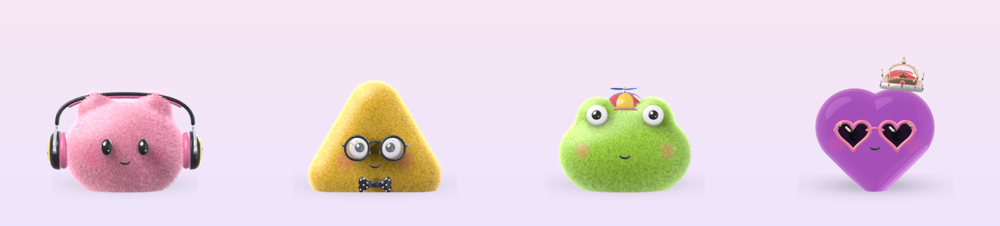
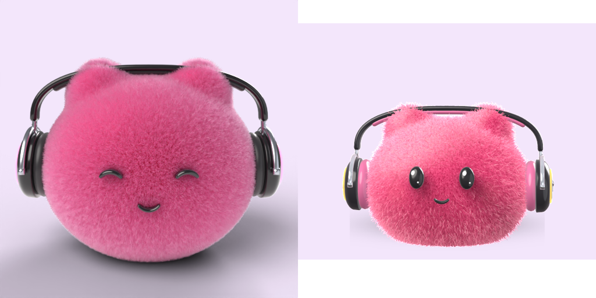
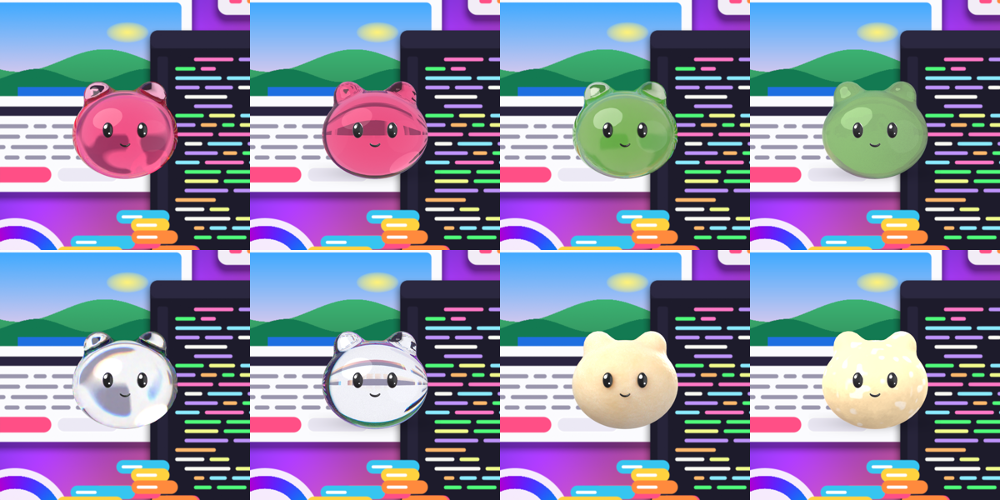
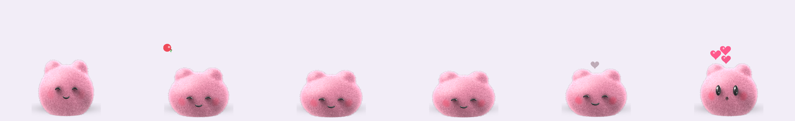
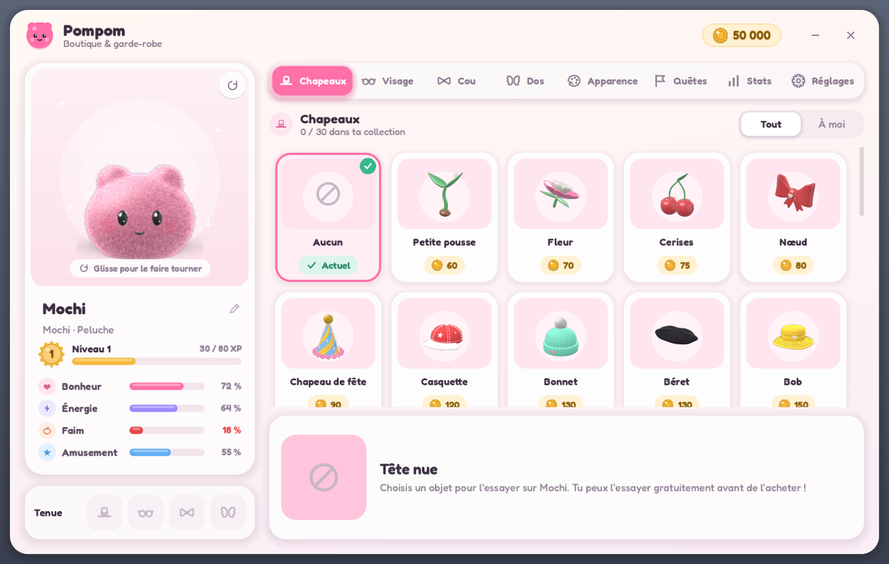
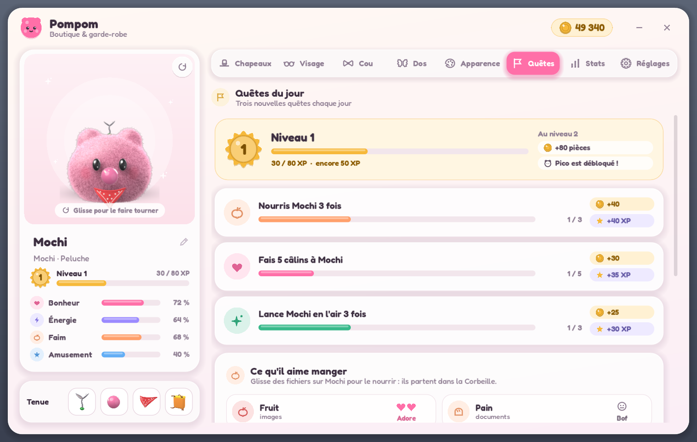
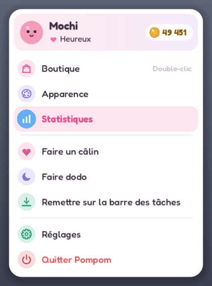
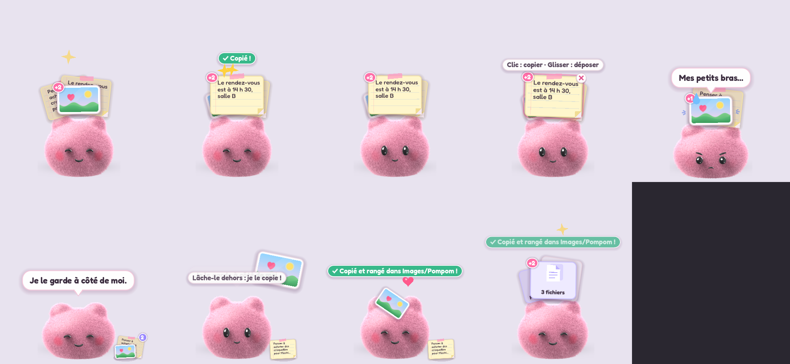

<div align="center">

# 🐾 Pompom

**Ton petit compagnon tout doux qui vit sur ton bureau.**

Un tamagotchi en 3D, tout en peluche, qui s'assoit sur ta barre des tâches, grimpe sur tes fenêtres,
travaille avec toi, joue avec toi… et mange tes vieux fichiers.

[](https://github.com/amintt2/pompom/actions/workflows/ci.yml)
[](https://github.com/amintt2/pompom/releases)
[](LICENSE)




**[⬇️ Télécharger la dernière version](https://github.com/amintt2/pompom/releases)** · [Journal des versions](CHANGELOG.md) · [Idées à venir](docs/idees_interactivite.md)

</div>

---

> ⚠️ **Bêta 0.1** : c'est la toute première version publique. Il y aura des bugs, n'hésite pas à
> [ouvrir une issue](https://github.com/amintt2/pompom/issues) !

## ✨ Ce qu'il sait faire

### Un vrai petit être sur ton bureau
- **Il vit par-dessus tes fenêtres** dans une fenêtre transparente. Les clics passent à travers, sauf sur lui.
- **Il s'assoit sur la barre des tâches**, et sur le haut des fenêtres.
  - Il suit une fenêtre quand tu la déplaces, tombe quand elle se ferme et saute parfois sur une fenêtre qui s'ouvre (l'Explorateur par exemple).
  - Quand il s'assoit, il s'enfonce un peu sous son poids.
- **Il te regarde** quand la souris approche, et se pousse si elle travaille juste à côté de lui.
- **Prends-le, lance-le** : il rebondit différemment selon sa matière. La gelée tremblote, le slime s'étale, la pâte reste écrasée, le bois fait « toc ».
- **Caresse-le** en frottant la souris dessus.
- **Il vit sa vie** : il tape sur un mini-ordi quand tu travailles, joue à la manette quand tu joues, sort son téléphone, danse et s'endort quand tu t'absentes.
- **En plein écran** (jeux, vidéos), il se fait discret et te regarde depuis le bord de l'écran.

### Un rendu « comme dans Blender »
- **Fourrure à brins** façon HairWorks : des dizaines de milliers de poils, ombrés comme de vrais cheveux.
- **Un éclairage tiré de rendus Cycles** (matcaps), avec occlusion douce sous les accessoires.
- **Gelée, slime et verre** recomposés en temps réel à partir de rendus Cycles (*environment matting*) : ils réfractent **ton vrai écran** comme une lentille.
- **Il reflète ton écran** et prend sa couleur : sur une page rose, son dos rosit.



<sub>À gauche le rendu Cycles de référence, à droite le jeu en temps réel.</sub>

### Un vrai jeu
- **Besoins** : faim, amusement, énergie et bonheur. S'il a faim, il te le dit.
- **Nourris-le avec tes fichiers** : glisse des fichiers depuis l'Explorateur sur lui.
  - Une image = un fruit, un document = du pain, un .zip = un bonbon, un .exe = un burger, une vidéo = un gâteau.
  - Chaque compagnon a ses goûts.
  - Les fichiers partent **dans la Corbeille** et sont toujours restaurables. Il ne touche jamais aux dossiers ni aux fichiers système.
- **Niveaux et XP**, compagnons débloqués en jouant, et **3 quêtes du jour**.
- **Des pièces** gagnées quand tu travailles ou que tu joues, et une boutique de **55 accessoires**.
- **Ses goûts** : il adore certains chapeaux et en déteste d'autres. Découvre-les en les essayant !



### Personnalisation
- **5 compagnons** : Mochi, Pico, Kiwi, Coco et Nuage.
- **10 matières** : peluche, velours, gelée, slime, pâte à pain, plastique, bois, chrome, verre et néon.
- **55 accessoires** (chapeaux, lunettes, cravate, nœud papillon, ailes, cape…), chacun en **3 couleurs** au choix.
- **13 styles d'yeux** et **12 bouches**.

| Boutique | Quêtes | Menu |
|---|---|---|
|  |  |  |

### Petit assistant (optionnel)
- **Gardien du presse-papiers** : ce que tu copies (image, texte, fichiers) apparaît sur sa tête.
  - Clic sur la carte : il la recopie. Glisse-la dehors : il la dépose.
  - S'il la porte trop longtemps, il fatigue…
- **Suggestions intelligentes** (en cours) : une petite IA locale (llama.cpp, modèle de moins de 1 Go) repère le champ où tu écris et te propose le bon élément copié. Tout reste sur ton PC.



## 📥 Installation

1. Télécharge **`Pompom.exe`** dans les [Releases](https://github.com/amintt2/pompom/releases).
2. Lance-le, c'est tout : il s'installe sur ta barre des tâches.

L'exe n'est pas encore signé. Windows SmartScreen peut afficher un avertissement : clique sur
**Informations complémentaires → Exécuter quand même**. L'empreinte SHA-256 de chaque version est publiée
dans `SHA256SUMS.txt`.

**Configuration** : Windows 10 ou 11, une carte graphique compatible DirectX 12. Une version mobile est prévue.

### Mises à jour automatiques
Pompom vérifie les nouvelles versions sur GitHub au démarrage, puis toutes les 6 heures. Quand il y en a une,
il te prévient : **clic droit sur lui → Mettre à jour**. Il télécharge la nouvelle version, **vérifie son empreinte
SHA-256**, remplace l'exe et redémarre. Il ne met jamais à jour sans ton accord. Tu peux désactiver la
vérification dans les réglages.

## 🖱️ Comment jouer

| Geste | Effet |
|---|---|
| Clic | Coucou ! (il saute ou fait une pirouette) |
| Frotter la souris dessus | Câlin ❤️ |
| Glisser | Le porter |
| Glisser puis lâcher en mouvement | Le lancer, et le poser sur une fenêtre |
| Double-clic | Ouvrir la boutique |
| Clic droit | Menu : boutique, apparence, statistiques, câlin, danse, dodo, réglages… |
| Déposer des fichiers sur lui | Le nourrir (Corbeille) |
| Icône dans la zone de notification | Boutique (clic gauche) ou menu (clic droit) |

## 🔒 Vie privée

- **Tout se passe sur ton PC.** La seule connexion réseau est la vérification des mises à jour, vers l'API publique des Releases GitHub.
- Pour savoir si tu travailles ou si tu joues, un petit script lit uniquement **ta durée d'inactivité** et le **nom de l'application au premier plan** (et son titre). Rien n'est enregistré à part tes statistiques de temps, rien n'est envoyé.
- **Reflets** : il capture la petite zone de l'écran autour de lui, en mémoire seulement. Avec les reflets activés, Windows ne le montre pas sur tes captures d'écran (désactivable).
- **Presse-papiers et IA** : ces options sont désactivées par défaut. Rien n'est écrit sur le disque, et il ignore ce qui vient des gestionnaires de mots de passe et ce qui ressemble à un secret.

## 🛠️ Compiler depuis les sources

```powershell
git clone https://github.com/amintt2/pompom.git
cd pompom
powershell -ExecutionPolicy Bypass -File setup_tools.ps1 -Templates   # Godot 4.7.2 portable + modèles d'export
.\tools\godot\Godot_v4.7.2-stable_win64.exe --path godot               # lancer le jeu
.\tools\godot\Godot_v4.7.2-stable_win64_console.exe --headless --path godot --export-release "Windows" ../build/Pompom.exe
```

Ouvrir le projet dans l'éditeur : `.\tools\godot\Godot_v4.7.2-stable_win64.exe --path godot -e`.

**Régénérer les modèles 3D** (optionnel) : `setup_tools.ps1 -Blender`, puis par exemple
`tools\blender-5.2.2-windows-x64\blender.exe --background --factory-startup --python blender\build_models.py`.

### Options de test
Ajoute-les après `--` :

| Option | Effet |
|---|---|
| `--species=kiwi` | Choisit le compagnon |
| `--material=gelee` | Choisit la matière |
| `--eyes=shiny` | Choisit les yeux |
| `--mouth=cat` | Choisit la bouche |
| `--equip=crown,bow_tie` | Lui met des accessoires |
| `--coins=999` | Donne des pièces |
| `--room` | Mode « chambre » (base de la version mobile) |
| `--snap --quit-after-snap` | Enregistre des images du rendu |
| `--lookdev=gelee` | Comparaison avec le rendu Cycles de référence |
| `--reflect=0` | Désactive les reflets (le rend visible sur les captures) |

Toute option `--clé=valeur` désactive la sauvegarde.

## 🧱 Architecture

```
pompom/
├─ godot/                  Projet Godot 4.7 (Forward+, Direct3D 12)
│  ├─ scripts/
│  │  ├─ pet/              Le compagnon : construction, fourrure, physique molle, actions
│  │  ├─ desktop/          Fenêtre de bureau, plateformes (fenêtres), capture d'écran, cerveau
│  │  ├─ game/             Nourriture (fichiers → Corbeille), affichage du jeu
│  │  ├─ assistant/        Presse-papiers, suggestions IA locales
│  │  ├─ ui/               Boutique, menus, thème, icônes, composants
│  │  ├─ autoload/         Data (catalogue), GameState (sauvegarde, progression), Activity
│  │  └─ util/             Mises à jour automatiques, démarrage avec Windows
│  ├─ shaders/             Fourrure (couches, brins, splats), matières, environment matting, reflets
│  ├─ helper/              Petits scripts Windows (activité, fenêtres, presse-papiers)
│  ├─ assets/              Modèles .glb, textures et matcaps Cycles, police
│  ├─ data/                Ancrages des espèces, accessoires, visages, rig studio
│  └─ tests/               Tests automatiques (boutique, presse-papiers, mises à jour)
├─ blender/                Scripts Blender (modèles, accessoires, visages, rendus de référence)
├─ assistant/              Service d'IA locale (llama.cpp)
├─ docs/                   Images, idées et design
└─ .github/workflows/      CI et publication des Releases
```

Le pipeline 3D est **100 % procédural**. Des scripts Python Blender génèrent les corps (surfaces SDF), 55
accessoires, les visages et des rendus Cycles de référence. Les matcaps et cartes d'*environment matting*
issus de ces rendus sont ensuite rejoués en temps réel dans Godot.

## ✅ Tests et CI

- **CI** (à chaque push / PR) : compilation de tous les scripts et shaders, test des mises à jour, validation des données JSON, syntaxe des scripts Blender.
- **Tests locaux** :
  - `powershell -File godot/tests/run_ui_test.ps1` : 209 vérifications de la boutique et des menus.
  - `powershell -File godot/tests/run_clipboard_test.ps1` : 70 vérifications du presse-papiers.

## 🚀 Publier une version

1. Mets à jour `config/version` dans `godot/project.godot` et ajoute une section au `CHANGELOG.md`.
2. Crée et pousse le tag : `git tag v0.2.0 && git push origin v0.2.0`.
3. Le workflow **Release** construit l'exe sur Windows, calcule son empreinte SHA-256 et publie la Release avec les notes du CHANGELOG.
4. Les Pompom déjà installés proposent la mise à jour automatiquement.

## 🗺️ Feuille de route

- Suggestions IA locales (llama.cpp) dans le champ où tu écris
- Vraie boîte aux lettres pendant les jeux, placement intelligent hors de l'interface du jeu
- Réactions à la musique, rituels de la journée, fêtes (Halloween !)
- Version mobile (Android / iOS)

Toutes les idées : [docs/idees_interactivite.md](docs/idees_interactivite.md).

## 🙏 Crédits

- Moteur : [Godot Engine](https://godotengine.org) (MIT). Modélisation et rendus : [Blender](https://www.blender.org) / Cycles.
- Police : [Fredoka](https://fonts.google.com/specimen/Fredoka) (SIL OFL 1.1).
- IA locale : [llama.cpp](https://github.com/ggml-org/llama.cpp) (MIT).
- Développé avec l'aide de [Claude Code](https://claude.com/claude-code).

Licence : [MIT](LICENSE).
